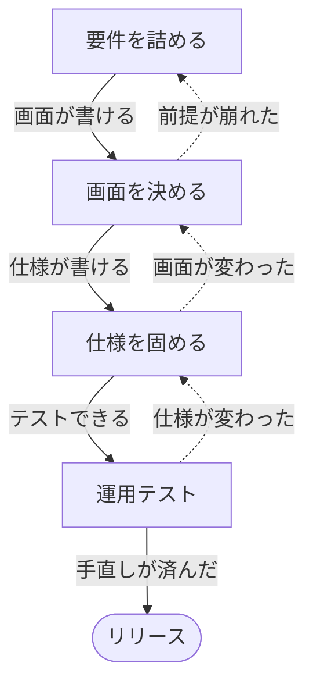

# 会議の流れ

<!-- 進行の型。固定の所与であり、会議のたびに変わるものではない。
     読むのは司会（メインセッション）。/meeting-open の現在地判定と
     /meeting-close の次回提案が、どちらもこのファイルを唯一の正として参照する。
     型は番号で呼ばない。名前で呼ぶ（番号を振ると順路に見えるため）。 -->

**方向性・スコープ・成功条件と、決定権の所在は、案件開始時に確定済みです。**
`docs/02_decision-log.md` と `docs/04_established-facts.md` に初期値として入っており、
**会議で決め直しません。** 会議はその先から始まります。

**何回開くかは決まっていません。** 何が決まったかで次が決まります。下の4つが会議の型で、
条件を満たさなければ**同じ型をもう一度開きます。**

## 4つの型

**型に番号は振りません。名前で呼びます。** 番号を振ると順路に見え、戻ることが失敗に見えるからです
（下の「型は順番ではなく状態」）。実線の矢印に書いてあるのが**次へ進む条件**、点線は**差戻し**で、どちらも正常な動きです。

| 型 | 目的 | 招集（参加形態） | 次へ進む条件 —— **次に誰の手が動くか** |
|---|---|---|---|
| **要件を詰める** | 4機能の業務詳細と判定基準を固める | `client-staff` full | **`sys-staff` が中核画面の設計に着手できる。** 業務詳細と判定基準が仮決め以上で揃い、答えの出なかったものが宿題として名指しで積まれている |
| **画面を決める** | 中核画面の承認を取る | `client-boss` full | **`sys-staff` が詳細仕様の執筆に着手できる。** 中核画面が **`承認済`** になり、承認ゲートが開いた |
| **仕様を固める** | 詳細仕様と周辺画面 | `client-staff` full（＋必要なら `sys-manager`） | **`client-boss` が運用テストに着手できる。** **詳細仕様書**（`22_detail-spec.md`）と**納品Excel**（`画面一覧・機能一覧.xlsx`）が揃った |
| **運用テスト** | **部長の指摘票**を捌く／機能追加を裁く | `client-boss` full（**主役**）＋ `sys-manager` bookend | **リリースできる。** 指摘票の手直しが終わり、`sys-manager` が機能追加を裁き終えた |

**条件を「誰の手が動くか」で書いてあるのは、`/meeting-open` の本日のゴールと同じ物差しにするためです。**
型の条件は**その型を何回か重ねて到達する終点**、本日のゴールは**その回で外すブロック**。粒度が違うだけで、
測っているものは同じ ——「次に手を動かす人が、動けるようになったか」です。

**質問リスト（`00_question-list.md`）は「要件を詰める」の道具であって、終了条件ではありません。**
`sys-staff` が自分で書くものなので、尽きたかどうかを本人の申告で測ると条件になりません。
**リストが尽きたかではなく、画面が書けるか**で判定します。

**運用テスト**の会議には、**部長が事前に運用テストを行った指摘票を持って出席します**（10〜15件。不具合・
使いにくさ・部長の誤解・ついでの新機能要求が混ざっており、仕分けはされていません）。

`sys-staff` と `sys-junior` は**常に full** です。この表は `/meeting-open` の招集ルールを
型ごとに言い換えたもので、別のルールではありません。目的を自由文で書けば同じ判断がされます。

**同じ型を何度開いてもかまいません。**「要件を詰める」が3回続くのは普通です。1回60分では4〜6論点しか
扱えないので、型ひとつが1回で終わる前提を持たないでください。**1回で全部決まらないのが正常**
というのは、型の中でも型と型の間でも同じです。

## 型は順番ではなく状態

**図の実線は典型的な進み方であって、決められた順路ではありません。** いま**誰の手が止まっているか**で
型が決まります。順路として読むと、戻ることが失敗に見えてしまいます。

| 起きること | 実際にやること |
|---|---|
| **「要件を詰める」なのに画面が要る** | 業務が言葉で出てこないときは、画面を見せたほうが早い。その回の中で `sys-junior` に叩き台を描かせてよい |
| **「画面を決める」→「要件を詰める」** | 画面を見た業務側が「そもそもこの単位では困る」と言い出したら、それは要件の積み残し。画面ではなく前提を直す |
| **「仕様を固める」→「画面を決める」** | 詳細仕様を書いていて画面の穴に気づいたら、承認を取り直す（承認ゲートは仕様より先） |
| **「運用テスト」→「仕様を固める」** | 指摘票が仕様の穴を突いていたら、手直しではなく仕様の修正 |

**型を宣言するのは、その回で外すブロックを絞るためです。** 型どおりに進めるためではありません。

## 日程の目安

`12_briefing.md` より。**リリースは2か月後**、完成目標はその2週間前、運用テストは1か月前からです。

| 時期 | やっていること |
|---|---|
| 開始 〜 2週 | 要件を詰める |
| 2週 〜 1か月 | 要件を詰める ／ 画面を決める |
| 1.5か月（完成目標） | 仕様を固める |
| 1か月 〜 2か月 | 運用テスト＋手直し |
| **2か月後** | **リリース** |

日程が詰まっているのは意図的です。要件が膨らむと**日程ではなくスコープを削る**判断が要ります。

## 現在地の判定

**いまどの型にいるかは、「次に手を動かす人が動けるか」で決まります。** 材料は **`/status`**（決定・仮決め・
宿題・画面の承認状態・決定権ステータス・枠の残り）と、開催履歴の `01_session-log.md`。

| いま止まっている人 | 現在地 |
|---|---|
| `sys-staff` が**画面を書けない**（業務詳細・判定基準が無い） | **要件を詰める** |
| `sys-staff` が**詳細仕様を書けない**（中核画面が未承認） | **画面を決める** |
| `client-boss` が**テストできない**（仕様書とExcelが未完） | **仕様を固める** |
| 指摘票の手直しが残っている | **運用テスト** |

- **開会時** — `/meeting-open` が本日の型を判定し、条件のうち**まだ欠けているもの**を**現在地**に置く。**本日のゴールはその先**で、「閉会後に誰が次に着手できるか」の形で立てる（`/meeting-open` 手順4）
- **閉会時** — `/meeting-close` が条件を満たしたかを言い、満たしていなければ**同じ型をもう一度**提案する
