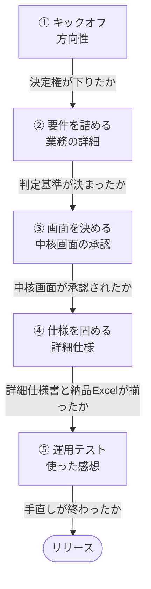

# 会議の流れ

<!-- 進行の型。固定の所与であり、会議のたびに変わるものではない。
     読むのは司会（メインセッション）。/meeting-open の現在地判定と
     /meeting-close の次回提案が、どちらもこのファイルを唯一の正として参照する。 -->

**何回開くかは決まっていません。** 何が決まったかで次が決まります。下の5つが会議の型で、
条件を満たさなければ**同じ型をもう一度開きます。**

| # | 型 | 目的 | 招集（参加形態） | 次へ進む条件 |
|---|---|---|---|---|
| **①** | **キックオフ** | 方向性・スコープ・成功条件を決める | `client-boss` opening ＋ `sys-manager` bookend | **決定権が下りた**（`04` のステータスが「確認済」） |
| **②** | **要件を詰める** | 4機能の業務詳細と判定基準を固める | `client-staff` full | 仮決めが本決めに昇格し、質問リストが尽きた |
| **③** | **画面を決める** | 中核画面の承認を取る | `client-boss` full | 中核画面が **`承認済`** になった |
| **④** | **仕様を固める** | 詳細仕様と周辺画面 | `client-staff` full（＋必要なら `sys-manager`） | **詳細仕様書**（`22_detail-spec.md`）と**納品Excel**（`画面一覧・機能一覧.xlsx`）が揃った |
| **⑤** | **運用テスト** | **部長の指摘票**を捌く／機能追加を裁く | `client-boss` full（**主役**）＋ `sys-manager` bookend | 手直しが終わった → リリース |

型⑤ の会議には、**部長が事前に運用テストを行った指摘票を持って出席します**（10〜15件。不具合・使いにくさ・
部長の誤解・ついでの新機能要求が混ざっており、仕分けはされていません）。

`sys-staff` と `sys-junior` は**常に full** です。この表は `/meeting-open` の招集ルールを
型ごとに言い換えたもので、別のルールではありません。目的を自由文で書けば同じ判断がされます。

**同じ型を何度開いてもかまいません。** ②が3回続くのは普通です。1回30分では2〜3論点しか
扱えないので、型ひとつが1回で終わる前提を持たないでください。**1回で全部決まらないのが正常**
というのは、型の中でも型と型の間でも同じです。

## 日程の目安

`12_briefing.md` より。**リリースは2か月後**、完成目標はその2週間前、運用テストは1か月前からです。

| 時期 | やっていること |
|---|---|
| 開始 〜 2週 | ① ② |
| 2週 〜 1か月 | ② ③ |
| 1.5か月（完成目標） | ④ |
| 1か月 〜 2か月 | ⑤ 運用テスト＋手直し |
| **2か月後** | **リリース** |

日程が詰まっているのは意図的です。要件が膨らむと**日程ではなくスコープを削る**判断が要ります。

## 現在地の判定

上の「次へ進む条件」を満たしたかは **`/status`** で判定できます（決定・仮決め・宿題・画面の承認状態・
決定権ステータス・枠の残りが一覧で出ます）。開催履歴は `01_session-log.md`。

- **開会時** — `/meeting-open` が本日の型を判定し、条件のうち**まだ欠けているもの**を本日のゴールに置く
- **閉会時** — `/meeting-close` が条件を満たしたかを言い、満たしていなければ**同じ型をもう一度**提案する
